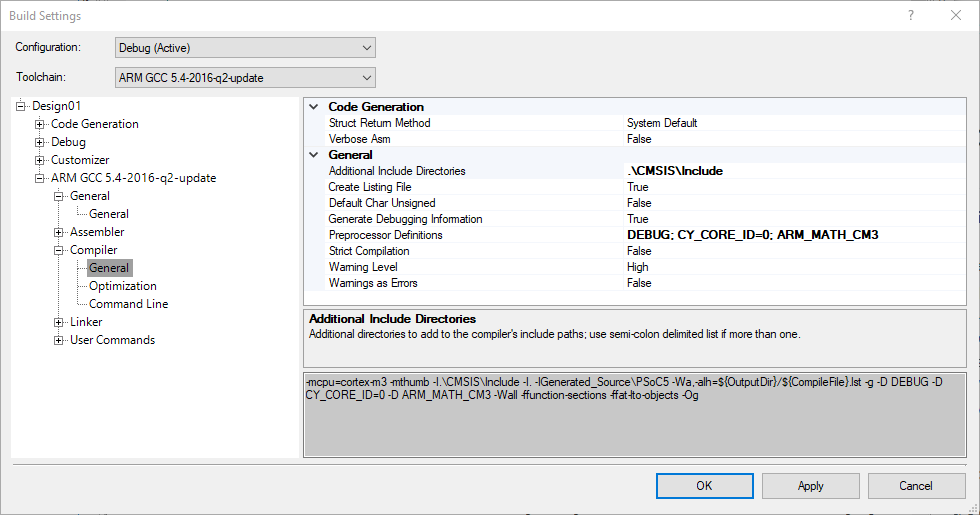
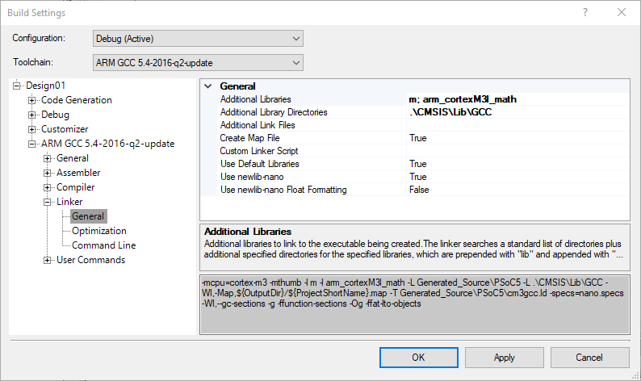

# Exemplo de uso do CMSIS-DSP com o PSoC

Esse é um projeto exemplo de como utilizar o ARM CMSIS-DSP com o PSoC 5lp. O projeto é baseados nos seguintes elementos:

- CY8CKIT-059 PSoC 5LP Prototyping Kit
- PSoC Creator 4.4
- CMSIS-DSP 4.5

## Integração do CMSIS-DSP com o PSoC

Para esse projeto foi utilizada a versão 4.5 do CMSIS disponível em https://github.com/ARM-software/CMSIS. Essa versão foi escolhida por já incluir a biblioteca compilada, simplificando o processo. Caso deseje usar a versão mais recente é necessário compilar a biblioteca usando o CMAKE. Instruções desse processo podem ser encontradas em https://github.com/ARM-software/CMSIS_5/tree/develop/CMSIS/DSP.

Processo de integração do CMSIS-DSP no PSoC usando o PSoC Creator:

1. Copie a biblioteca CMSIS-DPS para o seu projeto.
2. Configure as opções do compilador.
3. Configure as opções do Linker.

### 1. Copiando a biblioteca para o projeto

Simplesmente copie a pasta CMSIS para o seu projeto. Essa pasta irá incluir os arquivos de cabeçalho (.h) no diretório *Include* e a biblioteca compilada no diretório *lib/GCC*. Os demais arquivos correspondem à documentação, exemplos e outras ferramentas. Acredito que podem ser excluídos caso necessário.

### 2. Configurando as opções do compilador

Clique com o botão direito no seu projeto e no menu escolha a opção *Build Settings...*. Em seguida expanda a seção para o compilador *ARM GCC* -> *Compiler* -> *General* (Figura 1).

**Figura 1** - Configuração do compilador.

As seguintes configurações devem ser editadas:

1. **Additional Include Directories**: Deve incluir o diretório *Include* do CMSIS.
2. **Preprocessor Definitions**: Deve-se adicionar a definição *ARM_MATH_CM3*, correspondente ao processador Cortex-M3 do PSoC 5lp.

### 3. Configurando as opções do *linker*

Em seguinda deve-se configurar o Linker. De maneira semelhante, devemos acessar o menu *Build Settings...* e em seguida a seção *ARM GCC* -> *Linker* -> *General* (Figura 2).

**Figura 2** - Configuração do *linker*.

As seguintes configurações devem ser editadas:

1. **Additional Libraries**: Deve-se adicionar a definição *m* e *arm_cortex_M3l_math*, também correspondentes ao processador ARM Cortex-M3.
2. **Additional Library Directories**: Deve incluir o diretório *Lib\GCC* do CMSIS.

Após realizar esses passos, basta incluir a biblioteca *arm_math.h* no seu código e utilizar as funções do CMSIS-DSP.

## Referências

1. [Including the Cortex Microcontroller Software Interface Standard (CMSIS) Library in a PSoC® Creator™ Project - KBA90457](https://www.cypress.com/comment/300971)
2. [Audio spectroscope using Cypress PSoC 5LP and CMSIS DSP library](https://github.com/SannySannyman/PSoC_Spectroscope)
